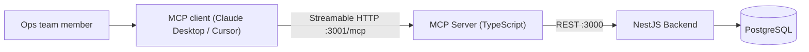

# AI-Native Order-to-Cash Ops Platform

An AI-native solution that makes an e-commerce operations team independent of engineering for the **Order-to-Cash (O2C)** process. Instead of filing tickets, ops speaks to an AI agent (any MCP client — Claude Desktop, Cursor, etc.), which diagnoses and fixes issues through a set of safe, audited tools.

## Architecture



| Component | Tech | Port |
|---|---|---|
| `backend/` | NestJS + TypeORM + PostgreSQL | 3000 |
| `mcp-server/` | TypeScript, `@modelcontextprotocol/sdk` (Streamable HTTP, stateless) | 3001 |
| `postgres` | PostgreSQL 16 (Docker) | 5433 (host) |

## Quick start

Requires Docker (with Compose).

```bash
docker compose up -d --build
```

This starts Postgres, the backend (which auto-creates the schema and seeds demo data, including intentionally broken orders), and the MCP server.

Smoke test:

```bash
curl http://localhost:3000/health          # backend
curl http://localhost:3001/health          # MCP server
curl http://localhost:3000/ops/summary     # should report 7 issues needing attention
```

## Connect your AI agent

The MCP server speaks Streamable HTTP at `http://localhost:3001/mcp`.

**Cursor** — add to `.cursor/mcp.json` (project) or `~/.cursor/mcp.json` (global):

```json
{
  "mcpServers": {
    "o2c-ops": {
      "url": "http://localhost:3001/mcp"
    }
  }
}
```

**Claude Desktop** — Settings → Connectors → Add custom connector, with URL `http://localhost:3001/mcp` (or use `mcp-remote` in `claude_desktop_config.json`):

```json
{
  "mcpServers": {
    "o2c-ops": {
      "command": "npx",
      "args": ["mcp-remote", "http://localhost:3001/mcp"]
    }
  }
}
```

## What the agent can do

19 tools, split into diagnostics (read) and fixes (write). **Every write requires a `reason`, which is recorded in an immutable audit log** along with the actor and before/after snapshots — so ops actions stay traceable without engineering involvement.

| Area | Tools |
|---|---|
| Diagnostics | `ops_summary`, `diagnose_order`, `search_orders`, `get_order`, `get_inventory`, `reconcile_inventory`, `get_audit_log` |
| Payments | `retry_payment`, `reconcile_payment`, `issue_refund` |
| Orders | `cancel_order`, `force_order_status` (state-machine guarded) |
| Inventory | `adjust_inventory`, `release_reservations` |
| Fulfillment | `create_shipment`, `update_shipment_tracking`, `mark_delivered` |
| Invoicing | `generate_invoice`, `regenerate_invoice` |

`diagnose_order` runs a rules engine over an order's full O2C timeline and returns each detected issue with severity and the suggested fix tool, so the agent diagnoses before mutating.

## Demo scenarios (seeded broken orders)

The database is seeded with ~20 orders; seven have realistic O2C problems:

| Order | Problem | Fix the agent will apply |
|---|---|---|
| ORD-1101 | Stuck in PAYMENT_PENDING for 2 days, card declined 3 times | `retry_payment` (or `cancel_order`) |
| ORD-1107 | Payment marked FAILED after gateway timeout, but the gateway actually captured it | `reconcile_payment` (avoids double charge) |
| ORD-1102 | PAID 3 days ago, fulfillment never created a shipment | `create_shipment` |
| ORD-1103 | DELIVERED but no invoice was generated | `generate_invoice` |
| ORD-1104 | Invoice is 10.00 short of the order total | `regenerate_invoice` |
| ORD-1106 | Customer refund request pending for days | `issue_refund` |
| ORD-1105 | CANCELLED order never released its stock reservation (2x SKU-WATCH blocked) | `release_reservations` |

Example prompts to try against the connected agent:

- "What needs attention in our order pipeline right now?"
- "Why is order ORD-1101 stuck? Fix it."
- "A customer says they were charged for ORD-1107 but it shows unpaid. Investigate carefully — don't double-charge them."
- "Smart Watch stock looks wrong — we have units on the shelf that the system says are reserved. Find out why and fix it."
- "Show me everything ops changed on ORD-1102 and why."

## Order-to-Cash state machine

```
CREATED → PAYMENT_PENDING → PAID → FULFILLING → SHIPPED → DELIVERED → COMPLETED
                 ↘ CANCELLED (before shipping)        ↘ REFUNDED (after payment)
```

`force_order_status` only allows valid forward transitions and keeps inventory consistent (shipping decrements stock, cancelling releases reservations).

## REST API (used by the MCP server)

| Method | Path | Purpose |
|---|---|---|
| GET | `/ops/summary` | Fleet-wide health summary |
| GET | `/ops/diagnose/:order` | Rule-based diagnosis of one order |
| GET | `/orders` | Search (`status`, `email`, `q`, `stuckHours`) |
| GET | `/orders/:order` | Full timeline incl. audit trail |
| POST | `/orders/:order/cancel` | Cancel and release stock |
| POST | `/orders/:order/force-status` | Guarded status transition |
| POST | `/orders/:order/payments/retry` | Retry via (simulated) gateway |
| POST | `/orders/:order/payments/reconcile` | Reconcile with gateway records |
| POST | `/orders/:order/refunds` | Full/partial refund |
| POST | `/orders/:order/shipments` | Create shipment |
| POST | `/orders/:order/shipments/tracking` | Attach tracking (marks SHIPPED) |
| POST | `/orders/:order/shipments/delivered` | Mark delivered |
| POST | `/orders/:order/invoice` | Generate missing invoice |
| POST | `/orders/:order/invoice/regenerate` | Void + reissue incorrect invoice |
| GET | `/inventory` | Stock levels with availability |
| GET | `/inventory/reconcile` | Detect reservation leaks |
| POST | `/inventory/adjust` | Adjust stock with reason |
| POST | `/inventory/release-reservations` | Release leaked reservations |
| GET | `/audit` | Query the audit log |

`:order` accepts an order number (`ORD-1101`) or UUID.

## Resetting the demo

Seeding is idempotent (runs only on an empty database). To restore the broken scenarios after fixing them:

```bash
docker compose down -v && docker compose up -d
```

## Local development (without Docker)

```bash
# Postgres must be reachable; configure via DB_HOST/DB_PORT/DB_USER/DB_PASSWORD/DB_NAME
cd backend && npm install && npm run build && npm start
cd mcp-server && npm install && npm run build && BACKEND_URL=http://localhost:3000 npm start
```

## Project structure

```
backend/
  src/
    entities/     # Customer, Product, Order, OrderItem, Payment, Refund, Shipment, Invoice, AuditLog
    orders/       # search, timeline, cancel, guarded force-status
    payments/     # retry, gateway reconcile, refunds
    inventory/    # stock, adjustments, reservation release/reconcile
    shipments/    # create, tracking, delivered
    invoices/     # generate, void + regenerate
    ops/          # diagnose rules engine, health summary
    audit/        # immutable audit log (global module)
    seed/         # idempotent demo data incl. broken scenarios
mcp-server/
  src/
    index.ts      # Express + stateless Streamable HTTP transport
    tools.ts      # 19 MCP tool definitions (zod schemas)
    api.ts        # thin REST client for the backend
docker-compose.yml
```
