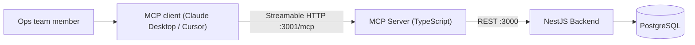

# AI-Native Order-to-Cash Ops Platform

An AI-native solution that makes an e-commerce operations team independent of engineering for the **Order-to-Cash (O2C)** process. Instead of filing tickets, ops speaks to an AI agent (any MCP client — Claude Desktop, Cursor, etc.), which diagnoses and fixes issues through a set of safe, audited tools.

## Hosted MCP (for reviewers)

| | |
|---|---|
| **MCP URL** | `https://outline-breakdown-receiving-rendered.trycloudflare.com/mcp` |
| **Health** | `https://outline-breakdown-receiving-rendered.trycloudflare.com/health` |
| **Transport** | Streamable HTTP (stateless) |

This public HTTPS endpoint is a Cloudflare quick tunnel in front of the Dockerized MCP server. Keep `docker compose up -d` and `./scripts/start-tunnel.sh` running while reviewers test. The hostname is ephemeral; `start-tunnel.sh` rewrites `.cursor/mcp.json` and the tunnel URLs in this README whenever cloudflared issues a new one.

**Cursor** (project `.cursor/mcp.json` is already pointed at the hosted URL):

```json
{
  "mcpServers": {
    "o2c-ops": {
      "url": "https://outline-breakdown-receiving-rendered.trycloudflare.com/mcp"
    }
  }
}
```

Smoke / workflow checks against the host:

```bash
curl https://outline-breakdown-receiving-rendered.trycloudflare.com/health
MCP_URL=https://outline-breakdown-receiving-rendered.trycloudflare.com ./scripts/verify-workflow.sh
```

### Longer-lived alternative (Render Blueprint)

`render.yaml` defines `o2c-backend`, `o2c-mcp`, and Postgres. In [Render](https://render.com): **New → Blueprint →** connect this repo. After deploy, replace the tunnel URL above with `https://<o2c-mcp-service>.onrender.com/mcp`. Free web services cold-start; Postgres plan availability varies — see `PRODUCT.md`.

## Submission docs

| Doc | Contents |
|---|---|
| [`PRODUCT.md`](./PRODUCT.md) | Decisions, assumptions, exclusions, safety, tradeoffs |
| [`AI_WORKLOG.md`](./AI_WORKLOG.md) | Models, prompts, human/AI split, corrections, verification |
| [`DEMO.md`](./DEMO.md) | 4–5 minute async video checklist |
| [`scripts/verify-workflow.sh`](./scripts/verify-workflow.sh) | Focused runtime verification |

## Architecture



| Component | Tech | Port |
|---|---|---|
| `backend/` | NestJS + TypeORM + PostgreSQL | 3000 |
| `mcp-server/` | TypeScript, `@modelcontextprotocol/sdk` (Streamable HTTP, stateless) | 3001 |
| `postgres` | PostgreSQL 16 (Docker) | 5433 (host) |

## Quick start (local)

Requires Docker (with Compose).

```bash
docker compose up -d --build
```

This starts Postgres, the backend (which auto-creates the schema and seeds demo data, including intentionally broken orders), and the MCP server.

Smoke test + focused verification:

```bash
curl http://localhost:3000/health          # backend
curl http://localhost:3001/health          # MCP server
curl http://localhost:3000/ops/summary     # should report 7 issues needing attention
./scripts/verify-workflow.sh               # core workflow checks
```

Publish a fresh public URL (auto-updates README + `.cursor/mcp.json`):

```bash
./scripts/start-tunnel.sh
```

## Connect your AI agent (local)

The MCP server speaks Streamable HTTP at `http://localhost:3001/mcp` (or the hosted URL above).

**Cursor** — project `.cursor/mcp.json` or `~/.cursor/mcp.json`.

**Claude Desktop** — Settings → Connectors → Add custom connector, or:

```json
{
  "mcpServers": {
    "o2c-ops": {
      "command": "npx",
      "args": ["mcp-remote", "https://outline-breakdown-receiving-rendered.trycloudflare.com/mcp"]
    }
  }
}
```

## What the agent can do

19 tools, split into diagnostics (read) and fixes (write). **Every write requires a `reason`, which is recorded in an immutable audit log** along with the actor and before/after snapshots — so ops actions stay traceable without engineering involvement.

| Area | Tools |
|---|---|
| Diagnostics | `ops_summary`, `diagnose_order`, `search_orders`, `get_order`, `get_inventory`, `reconcile_inventory`, `get_audit_log` |
| Payments | `retry_payment`, `reconcile_payment`, `issue_refund` |
| Orders | `cancel_order`, `force_order_status` (state-machine guarded) |
| Inventory | `adjust_inventory`, `release_reservations` |
| Fulfillment | `create_shipment`, `update_shipment_tracking`, `mark_delivered` |
| Invoicing | `generate_invoice`, `regenerate_invoice` |

`diagnose_order` runs a rules engine over an order's full O2C timeline and returns each detected issue with severity and the suggested fix tool, so the agent diagnoses before mutating.

## Demo scenarios (seeded broken orders)

The database is seeded with ~20 orders; seven have realistic O2C problems:

| Order | Problem | Fix the agent will apply |
|---|---|---|
| ORD-1101 | Stuck in PAYMENT_PENDING for 2 days, card declined 3 times | `retry_payment` (or `cancel_order`) |
| ORD-1107 | Payment marked FAILED after gateway timeout, but the gateway actually captured it | `reconcile_payment` (avoids double charge) |
| ORD-1102 | PAID 3 days ago, fulfillment never created a shipment | `create_shipment` |
| ORD-1103 | DELIVERED but no invoice was generated | `generate_invoice` |
| ORD-1104 | Invoice is 10.00 short of the order total | `regenerate_invoice` |
| ORD-1106 | Customer refund request pending for days | `issue_refund` |
| ORD-1105 | CANCELLED order never released its stock reservation (2x SKU-WATCH blocked) | `release_reservations` |

Example prompts to try against the connected agent:

- "What needs attention in our order pipeline right now?"
- "Why is order ORD-1101 stuck? Fix it."
- "A customer says they were charged for ORD-1107 but it shows unpaid. Investigate carefully — don't double-charge them."
- "Smart Watch stock looks wrong — we have units on the shelf that the system says are reserved. Find out why and fix it."
- "Show me everything ops changed on ORD-1102 and why."

## Order-to-Cash state machine

```
CREATED → PAYMENT_PENDING → PAID → FULFILLING → SHIPPED → DELIVERED → COMPLETED
                 ↘ CANCELLED (before shipping)        ↘ REFUNDED (after payment)
```

`force_order_status` only allows valid forward transitions and keeps inventory consistent (shipping decrements stock, cancelling releases reservations).

## REST API (used by the MCP server)

| Method | Path | Purpose |
|---|---|---|
| GET | `/ops/summary` | Fleet-wide health summary |
| GET | `/ops/diagnose/:order` | Rule-based diagnosis of one order |
| GET | `/orders` | Search (`status`, `email`, `q`, `stuckHours`) |
| GET | `/orders/:order` | Full timeline incl. audit trail |
| POST | `/orders/:order/cancel` | Cancel and release stock |
| POST | `/orders/:order/force-status` | Guarded status transition |
| POST | `/orders/:order/payments/retry` | Retry via (simulated) gateway |
| POST | `/orders/:order/payments/reconcile` | Reconcile with gateway records |
| POST | `/orders/:order/refunds` | Full/partial refund |
| POST | `/orders/:order/shipments` | Create shipment |
| POST | `/orders/:order/shipments/tracking` | Attach tracking (marks SHIPPED) |
| POST | `/orders/:order/shipments/delivered` | Mark delivered |
| POST | `/orders/:order/invoice` | Generate missing invoice |
| POST | `/orders/:order/invoice/regenerate` | Void + reissue incorrect invoice |
| GET | `/inventory` | Stock levels with availability |
| GET | `/inventory/reconcile` | Detect reservation leaks |
| POST | `/inventory/adjust` | Adjust stock with reason |
| POST | `/inventory/release-reservations` | Release leaked reservations |
| GET | `/audit` | Query the audit log |

`:order` accepts an order number (`ORD-1101`) or UUID.

## Resetting the demo

Seeding is idempotent (runs only on an empty database). To restore the broken scenarios after fixing them:

```bash
docker compose down -v && docker compose up -d
```

## Local development (without Docker)

```bash
# Postgres must be reachable; configure via DB_HOST/DB_PORT/DB_USER/DB_PASSWORD/DB_NAME
cd backend && npm install && npm run build && npm start
cd mcp-server && npm install && npm run build && BACKEND_URL=http://localhost:3000 npm start
```

## Project structure

```
backend/          # NestJS + TypeORM + PostgreSQL
mcp-server/       # Streamable HTTP MCP (19 tools)
scripts/
  verify-workflow.sh   # focused runtime verification
  start-tunnel.sh      # public HTTPS tunnel for MCP
PRODUCT.md        # decisions, assumptions, exclusions
AI_WORKLOG.md     # AI tools, corrections, verification
DEMO.md           # async video checklist
render.yaml       # optional durable Render Blueprint
docker-compose.yml
```
